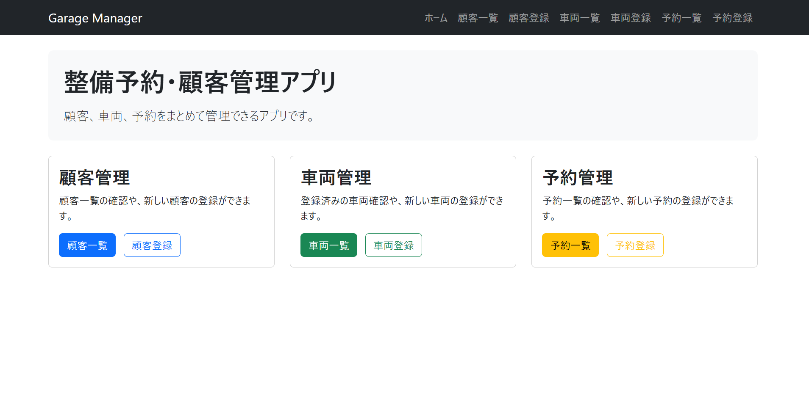
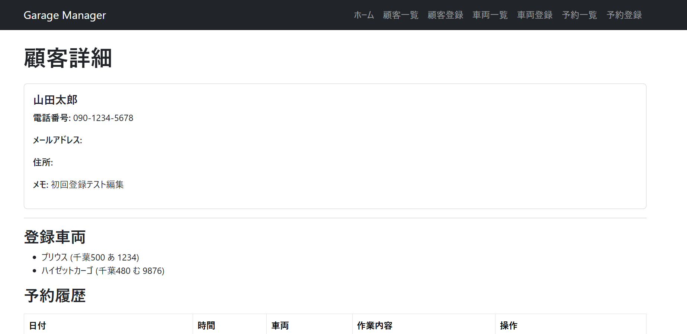
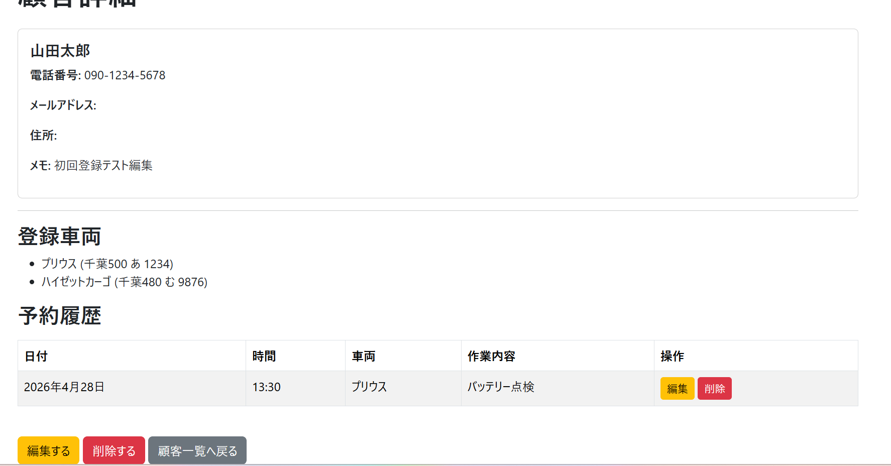
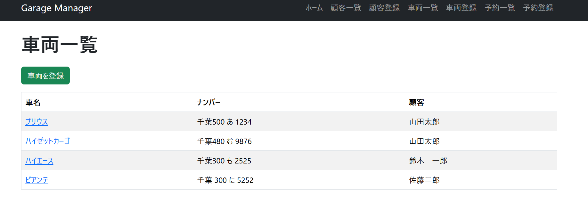
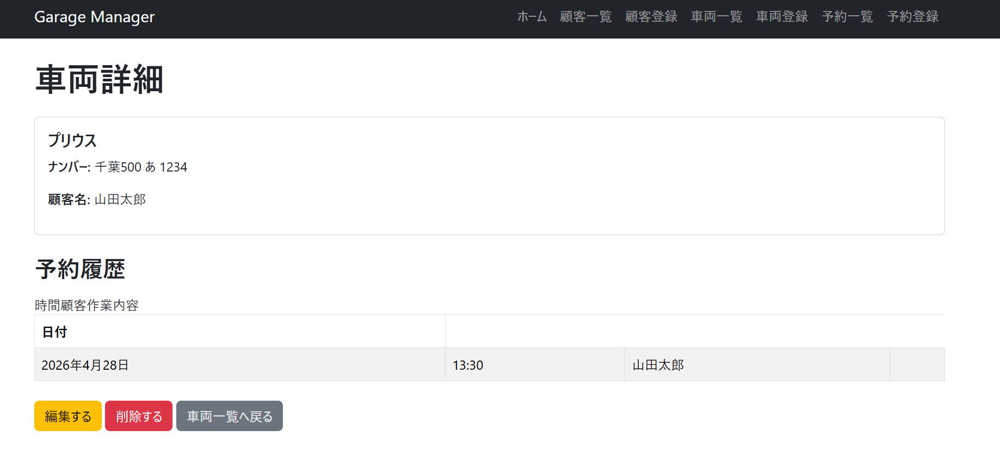
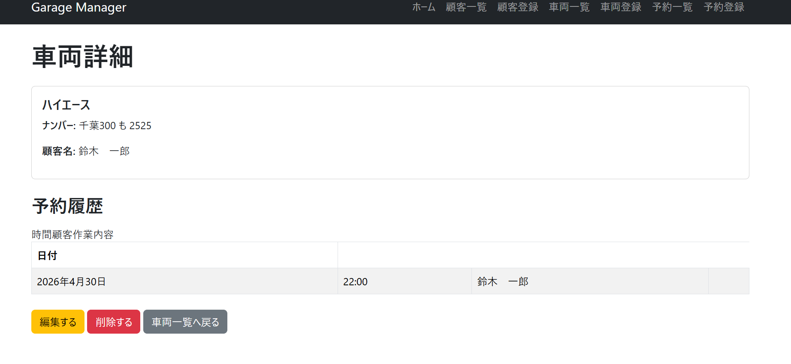
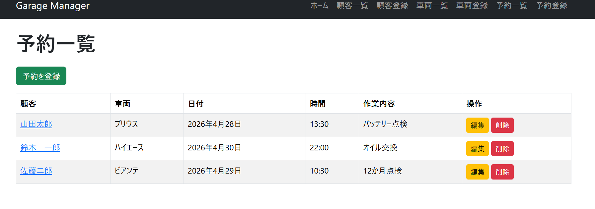
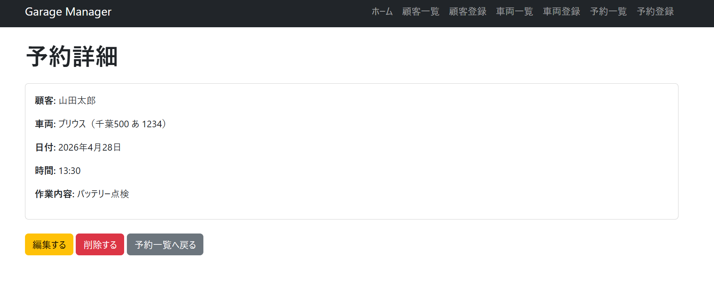
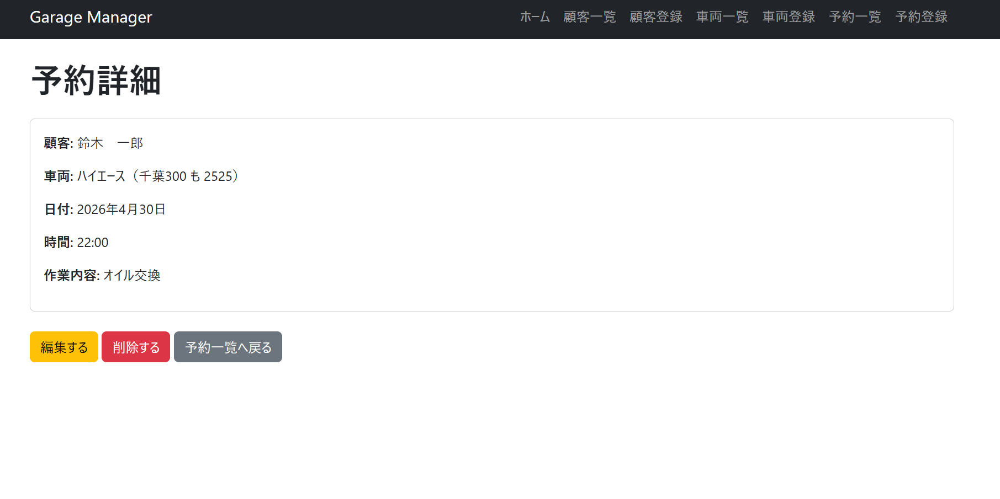
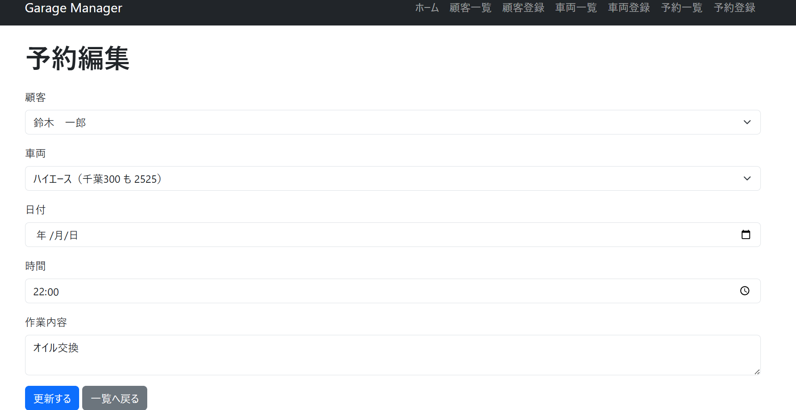

# Garage Manager（整備予約・顧客管理アプリ）

## アプリ概要
Djangoを用いて作成した整備予約・顧客管理アプリです。  
顧客・車両・予約を一元管理できるようにし、自動車整備の現場での運用を意識して設計しました。

---

## 主な機能

### 顧客管理
- 顧客一覧・登録・編集・削除

### 車両管理
- 車両一覧・登録・編集・削除

### 予約管理
- 予約一覧・登録・編集・削除

### 関連表示
- 顧客詳細 → 登録車両を表示
- 顧客詳細 → 予約履歴を表示
- 車両詳細 → 予約履歴を表示

---

## 使用技術
- Python
- Django
- SQLite
- Bootstrap
- HTML / Django Template

---

## 工夫した点
- 顧客・車両・予約をそれぞれ別モデルで管理し、ForeignKeyで関連付けを行った
- 顧客詳細画面から登録車両・予約履歴を確認できるように設計した
- 車両詳細画面からも予約履歴を確認できるようにし、実務での使いやすさを意識した
- CRUD機能をすべて自分で実装し、一覧・詳細・登録・編集・削除の流れを理解した

---

## 学習ポイント
- DjangoのMVC構造（Model / View / Template）の理解
- ForeignKeyによるモデル間のリレーション設計
- テンプレート構文（`{{ }}`, ``）
- 逆方向アクセス（例：`customer.reservation_set.all`）

---

## 今後の改善点
- ユーザー認証機能の追加
- 顧客に紐づく車両のみ選択できる予約機能
- 検索・絞り込み機能の追加
- UI/UXの改善
- 本番環境へのデプロイ

---

## 起動方法

```bash
python manage.py runserver

## 画像イメージ

### 整備予約・顧客管理アプリ


### 顧客詳細



### 車両一覧

### 車両詳細



### 予約一覧

### 予約詳細

                                   

          
